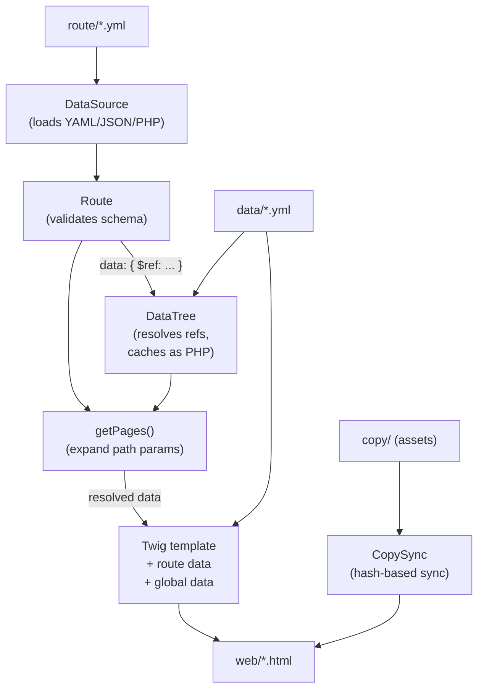
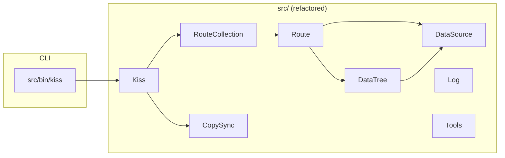

# Kiss PHP

**Keep It Simply Static** — a PHP static site generator.

## Concept

Kiss builds a complete static website from source files (routes, data, templates, assets) into a `web/` output directory. It then watches for file changes and incrementally rebuilds only what changed, giving you instant feedback.

Everything is loaded into a unified PHP data tree in memory — YAML, JSON, or PHP files are all treated the same. References (`$ref`) between files are resolved recursively and cached as PHP for OPcache acceleration.

### Data flow



### Data: global tree

Files in `data/` are loaded automatically into a single `{{ global }}` object available in every Twig template:

```twig
{{ global.site.title }}
{{ global.menu }}
```

### Routes

Routes are defined as files in the `route/` directory (YAML, JSON, or PHP). Each route file describes one page pattern:

```yaml
type: blog
path: /blog/{slug}.html
template: blog.twig
data:
  - $ref: data/posts.yaml
```

The `path` can contain `{param}` placeholders. When parameters are present, `data` must be an array of objects, each containing values for those parameters. The route expands into one page per data item.

Data can reference external files via `$ref`. The DataTree resolves these references recursively and merges their content:

```yaml
path: /about
template: page.twig
data:
  $ref: data/about.yaml
  extra_key: overrides or adds to the referenced content
```

On full rebuild, the route manifest tracks all generated HTML files. If a route is removed or a data source stops producing a page, the stale file is automatically cleaned from `web/`.

### CLI

```
kiss                Show help
kiss build          Full build: copy → route
kiss watch          Build once, then watch for file changes (inotifywait)
kiss reset [all|dist|cache]  Remove web/ or tmp/ folders
kiss copy [path]    Copy static assets (hash-based sync)
kiss route [all|list|<name>]  List routes, build a single route or all
```

When watching, only the affected subsystem rebuilds:
- `copy/` change → incremental copy via hash sync
- `data/` change → re-resolve data and rebuild routes
- `template/` change → rebuild routes
- `kiss.yml` change → full rebuild

### Key components

- **DataSource** (`src/DataSource.php`) — Loads and saves PHP, JSON, or YAML files. Low-level data access.
- **DataTree** (`src/DataTree.php`) — Resolves `$ref` references recursively across files. Caches resolved fragments as PHP files in `/tmp/kiss/{project_hash}/datatree/` (OPcache-friendly). Detects circular references.
- **Route** (`src/Route.php`) — Validates route config against a JSON schema, resolves data through DataTree, expands path parameters (`{slug}`, `{id}`...) into concrete pages.
- **RouteCollection** (`src/RouteCollection.php`) — Scans `route/` directory, loads all formats into Route objects.
- **CopySync** (`src/CopySync.php`) — Hash-based (crc32c) file synchronization. Only copies changed files, removes stale ones. Replaces `Filesystem::mirror()`.
- **Log** (`src/Log.php`) — Colored CLI output.
- **Tools** (`src/Tools.php`) — Utility functions (slugify, merge, path normalization).

### Component architecture



### Configuration

`kiss.yml` is auto-created on first run:

```yaml
path:
  copy: copy
  data: data
  route: route
  template: template
  dist: web
  cache: tmp
log:
  verbose: false
  color:
    path: yellow
    duration: green dim
    error: red dim
debug: false
```

The default cache path (`tmp`) is resolved at runtime to `/tmp/kiss/{md5_project_root}/kiss/` for performance (tmpfs/ramdisk). Override by setting an absolute path in `kiss.yml`.

Environment overrides:
- `KISS_DEBUG=true` — enables Twig debug mode
- `KISS_VERBOSE=true` — verbose log output
- `XDEBUG_MODE=coverage` — for PHPUnit coverage (set in `.env`)

## Install

```sh
make up
make composer i
```

All commands run inside the Docker container. Use `make shell` for a shell.

## Dev

```sh
make tests              # run all PHPUnit tests (72 tests)
make test -- --filter=X # run a single test
make phpcs              # PSR12 lint
make phpcs -- --report=diff  # Show fix suggestions
```

The project lives entirely in `src/` (PSR-4 namespace `Kiss\`).

## Commands reference

| Command | Action |
|---|---|
| `make up` | Start containers |
| `make down` | Stop containers |
| `make shell` | Bash into the app container |
| `make kiss -- <args>` | Run the Kiss CLI |
| `make tests` | Run all tests |
| `make test -- --filter=<name>` | Run a single test |
| `make composer -- <args>` | Run Composer |
| `make phpcs` | Run PHP CodeSniffer (PSR12) |
| `test-watch` | Auto-test loop via inotifywait |
| `make logs` | Container logs |
